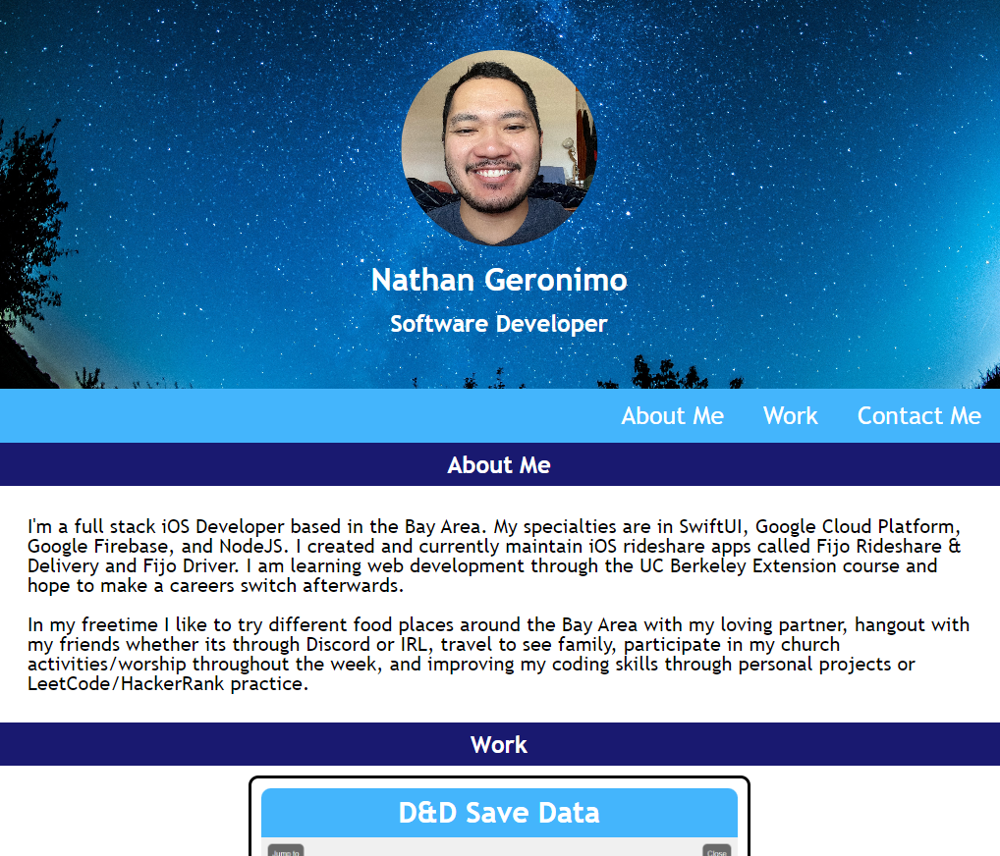
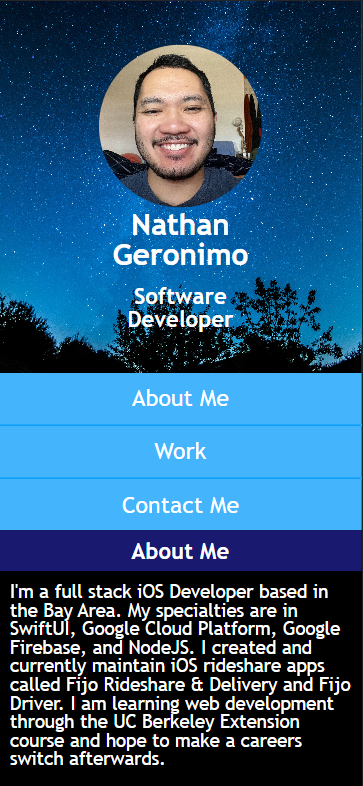

# My Portfolio

## Description

I'm Nathan Geronimo and this is a collection of apps and projects I've created and worked on!

Here's the link to my portfolio: [https://nathangero.github.io/my-portfolio/](https://nathangero.github.io/my-portfolio/)

I made this so I can showcase the work I'm proud of, and I hope that people will use some of the things I've made in the future. I always have ideas of new projects to make and I want to share that with everyone!

I've always wanted to make a website where people, like recruiters and friends, can see what I work on, and it's all gathered together in a neat little website.

### A Little About the Site

* This website was designed mobile first so I've created media queries to accommodate for bigger screens.
* The mobile version of this site supports both light and dark mode (depends on the system settings). 
* Browser only supports light mode. Will add dark mode in the future.
    * This is because most browsers would default to dark mode even after changing the theme of the computer to light.
* The first project under Work will always appear on top of the rest no matter the screen size.

### Code Snippets


Enable Mobile Dark Mode:
```css
@media screen and (max-width: 768px) and (prefers-color-scheme: dark) {
  body {
    background-color: var(--black);
  }

  p {
    color: var(--white);  
  }
  
  .card {
    border: var(--border-dark);
    /* Normal styling code here */
  }
}
```

### Website images

Browser:
<br>


Mobile:
<br>


## Usage

Using the website is pretty simple, you just scroll down the site to see the different sections. There's a navigation bar that will quickly jump you to the corresponding section. At the bottom there are links to different ways you can contact me. In the Work section, there are different cards that showcase the different apps and projects I've worked on. Clicking/tapping on a card will open a link to either the corresponding website or app store download.

## Things I've Learned

* Using multiple "and" in @media queries (as seen [here](#code-snippets))
* Usefulness of css variables for common styling like colors and border configurations.
* Importance of having an organized css file.
    * The order I had was: CSS variables, element selectors, class selectors, id selectors, media queries.
    * In addition I learned how important which styles come first. For example, in my ```.card``` class I would define the style of the display type, border, margin, etc, and then below it I would explicitly adjust the ```font-size``` of ```.card p``` and even the ``` .card h3```
* Importance of pseudo elements like ```:first-child```. That's how I was able to make the first card under Work be on top and bigger at all times without making a separate class.
    * Meaning, in the future if I want another project to be at the top, I can easily make a new ```<section class="card"></section>``` at the top of ```<section class="card-container>``` and I won't have to make changes of any class naming.


## Resources

### Code Resources

[Flexbox Tricks](https://css-tricks.com/snippets/css/a-guide-to-flexbox/#aa-flexbox-tricks)

[```<hr>``` styling](https://www.w3schools.com/howto/howto_css_style_hr.asp)

[How To Create a Hero Image](https://www.w3schools.com/howto/howto_css_hero_image.asp)

[.card styling from class #1](https://git.bootcampcontent.com/University-of-California---Berkeley/UCB-VIRT-FSF-FT-09-2023-U-LOLC/-/blob/main/course-content/02-advanced-css/activities/02-Stu_Media-Query-Screen/Unsolved/assets/css/style.css)

[.card styling from class #2](https://git.bootcampcontent.com/University-of-California---Berkeley/UCB-VIRT-FSF-FT-09-2023-U-LOLC/-/blob/main/course-content/02-advanced-css/activities/06-Stu_Responsive-Design/Unsolved/assets/css/style.css)

[Dark Mode](https://css-tricks.com/dark-modes-with-css/)

[Color Picker](https://www.w3schools.com/colors/colors_picker.asp#gsc.tab=0)

[Image Styling #1](https://www.w3schools.com/css/css3_images.asp)

[Image Styling #2](https://developer.mozilla.org/en-US/docs/Web/CSS/object-position)

### Image Resources

[Hero Image Source](https://www.pexels.com/photo/plants-under-starry-sky-355887/)

[Email Icon](https://icons8.com/icons/set/email)

[GitHub logo](https://github.com/logos)

[LinkedIn logo](https://brand.linkedin.com/content/brand/global/en_us/index/visual-identity/logo)

Fijo App images taken from the apps on my iPhone


## License

N/A